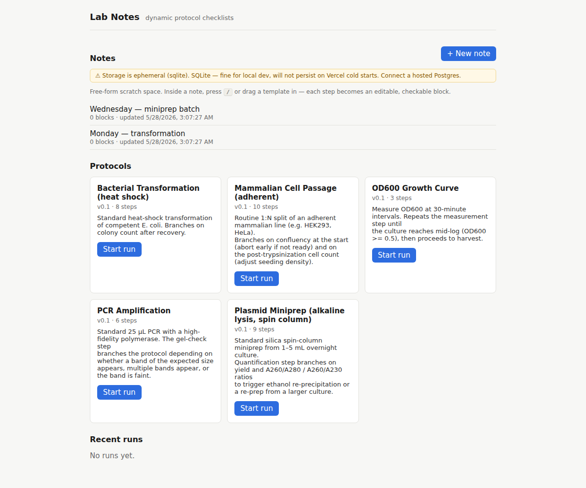
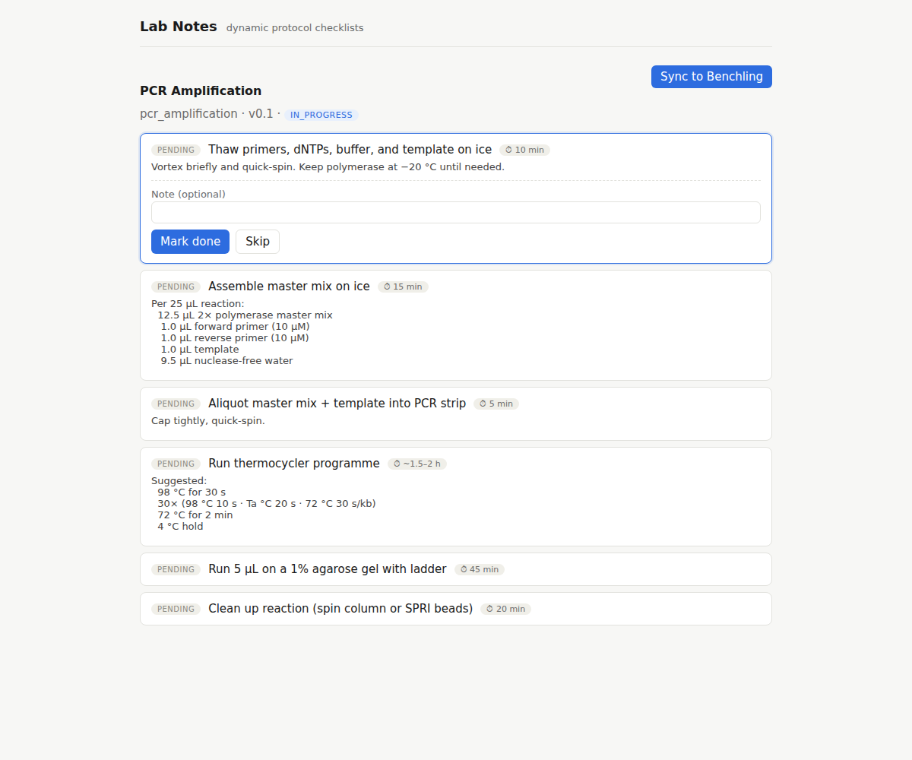
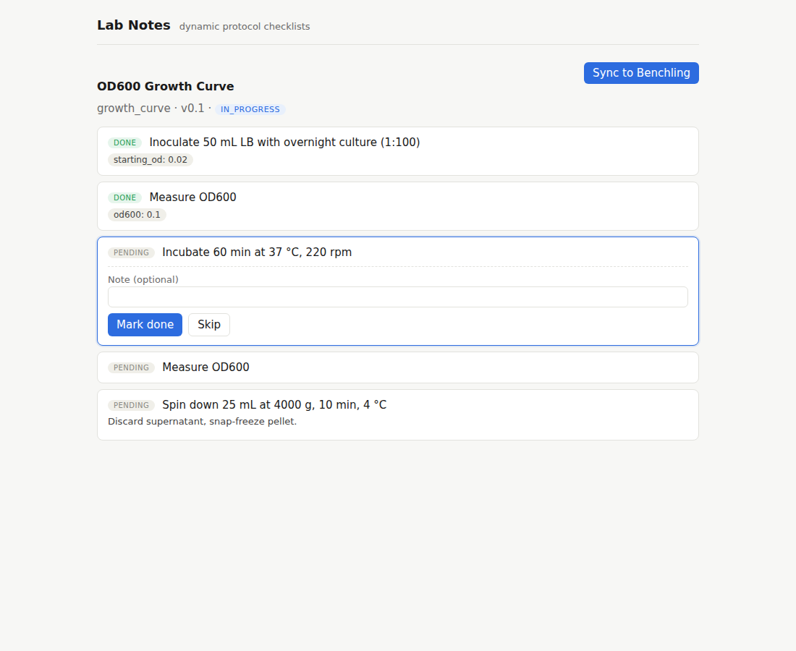
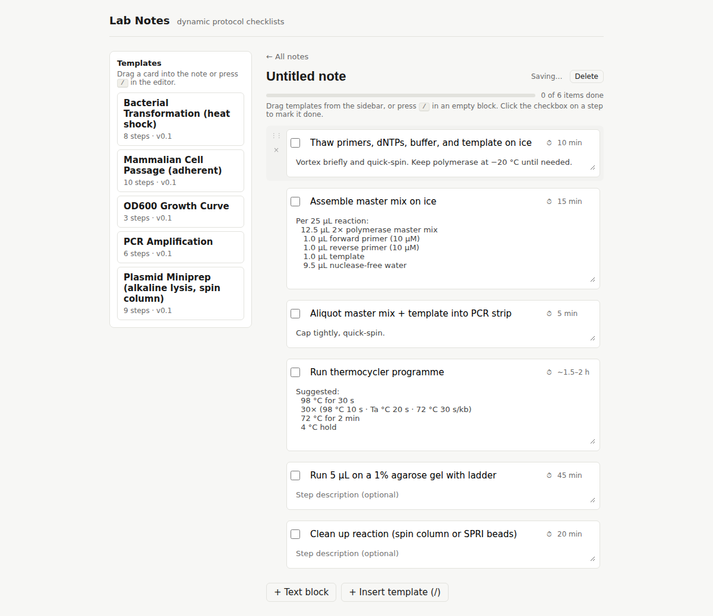
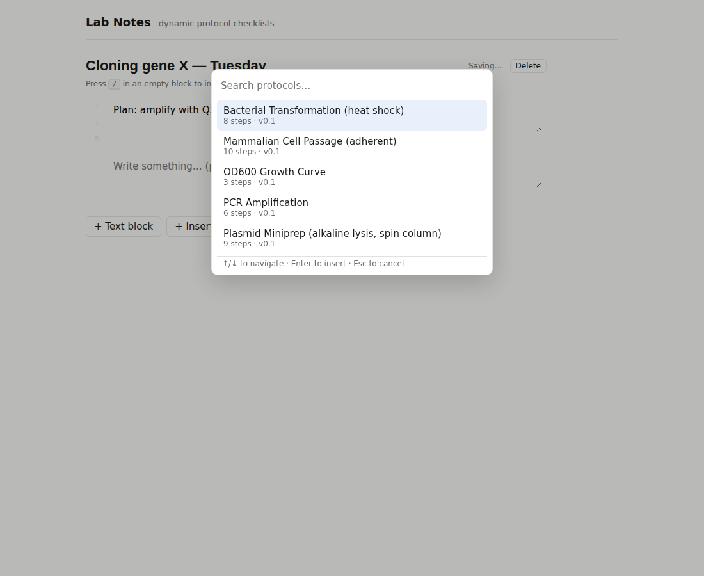
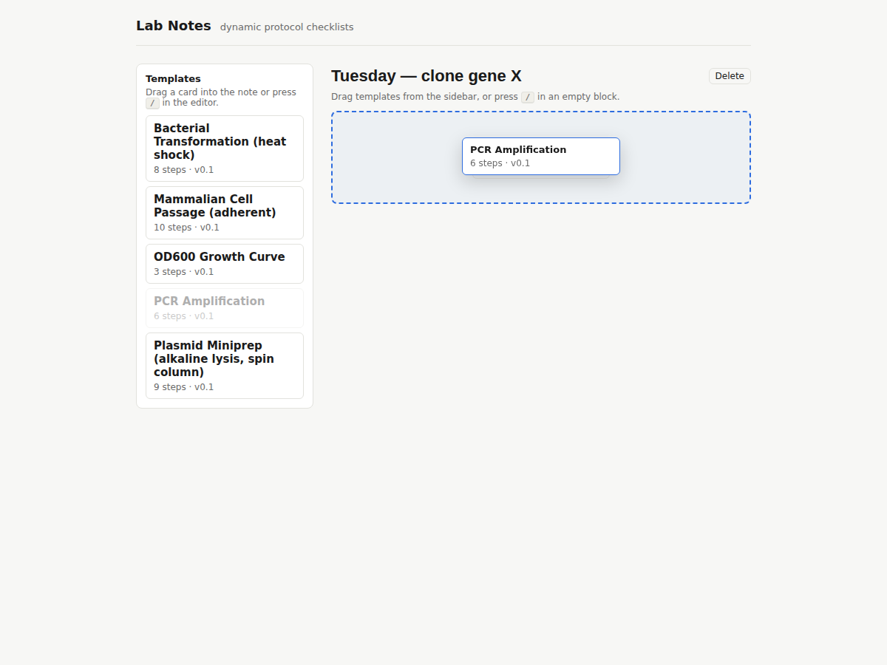
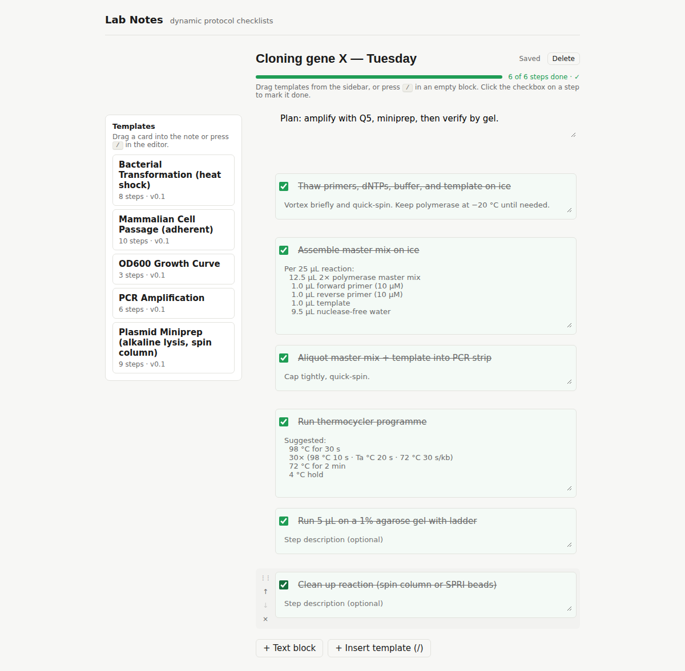

# Lab Notes — Design Handoff

A handoff for a design-focused pass on **Lab Notes**. The app works end to
end; what it needs now is a visual/UX design language. This doc gives you the
product context, the current state (with screenshots), the existing tokens and
components, the technical constraints, and the opportunities — so you can
propose and implement a redesign without reverse-engineering the codebase.

---

## 1. The ask

Give Lab Notes a coherent, polished design language. Concretely:

- A real visual identity (color, type, spacing, iconography) instead of the
  current placeholder beige.
- Stronger hierarchy and rhythm on all three surfaces.
- Make the **killer feature legible**: a protocol checklist that *rewrites
  itself* based on results you enter. Right now that magic is invisible.
- Polish the empty states, loading, and transitions.
- Keep it fast and lab-bench-friendly (often used one-handed, gloved, on a
  laptop next to instruments).

You may change CSS freely and restructure components. Keep the information
architecture and API shapes unless you flag a reason to change them.

---

## 2. Product in one paragraph

Lab Notes is a **dynamic todo list for lab protocols**. You start from a
protocol template (PCR, miniprep, bacterial transformation, etc.); as you work
through the checklist and enter results (OD600, colony count, gel bands), the
list **branches** — inserting troubleshooting steps, repeating a measurement
until a threshold is met, or skipping ahead. Separately, there's a freeform
**Notes** surface — a lab-notebook scratchpad where you compose your own
procedure by dragging templates in or typing, with checkboxes and per-step
timings. Runs can sync to Benchling as a notebook entry (mocked for now).

## 3. Who uses it

Bench scientists (grad students, RAs, postdocs) in molecular/cell biology
labs. They're mid-experiment: hands busy, timers running, often following a
protocol they've done 50 times but need to track *this* run's specifics. Speed
and at-a-glance status matter more than density of features.

---

## 4. The three surfaces

### A. Home (`/`)


Three stacked sections: **Notes** (primary, on top), **Protocols** (template
cards), **Recent runs**. Notes rows have a hover-reveal delete (×). The yellow
banner is a storage-health warning (only shows in dev / misconfigured deploys).

### B. Run (`/runs/:id`) — the dynamic checklist


A checklist instantiated from a protocol. The active step is highlighted and
expands a result-entry form (Mark done / Skip). Each step shows a status pill
and a ⏱ duration chip. **This is where branching happens:**



Here, entering a low OD600 caused the engine to **insert** an "Incubate 60 min"
step plus another "Measure OD600" before the next step — the list grew in
response to data. This dynamism is the whole point and currently has *zero*
visual fanfare; a user might not even notice the list changed.

### C. Note editor (`/notes/:id`)


Two columns: a sticky **Templates** sidebar (draggable cards) and the **block
editor**. Blocks are either free text or steps (title + description + editable
⏱ time). Each block has a checkbox; a top progress bar tracks completion.

Key interactions:

- **Slash command** — press `/` in an empty block to insert a template:
  
- **Drag a template** from the sidebar into the note (expands to step blocks):
  
- **Checklist / done state** — checked steps strike through and dim:
  

Block gutter (hover-reveal) has a drag grip (⋮⋮) and delete (×).

---

## 5. Current design system (as-is)

All styling is hand-written plain CSS in `web/src/styles.css`. There is no
framework (no Tailwind, no CSS-in-JS). Tokens live in `:root`:

| Token | Value | Use |
|---|---|---|
| `--bg` | `#f7f7f5` | page background (warm off-white) |
| `--fg` | `#1a1a1a` | primary text |
| `--muted` | `#6b6b6b` | secondary text |
| `--border` | `#e2e2dd` | hairlines, card borders |
| `--accent` | `#2d6cdf` | primary action / links (blue) |
| `--done` | `#1f9d55` | completed / success (green) |
| `--pending` | `#8a8a83` | pending status |
| `--skipped` | `#b08400` | skipped status (amber) |
| `--error` | `#b00020` | errors |

- **Type:** system stack (`-apple-system, system-ui, "Segoe UI", sans-serif`),
  base 15px. No type scale defined — sizes are ad hoc (11–22px).
- **Layout:** centered `max-width` containers (880px app, 720px note page).
  Cards use `border-radius: 6–8px`, 1px borders, white fills.
- **Iconography:** Unicode glyphs only (`⋮⋮ × ↑ ⏱ ✓ ⚠`). No icon library.
- **Components present:** cards, status pills, chips (duration/result),
  progress bar, slash popover (modal), draggable sidebar cards, editor blocks,
  dashed empty-drop zone, inline form fields.
- **Motion:** almost none beyond dnd-kit's drag transforms and a couple of
  `transition` hovers.

It is intentionally utilitarian and unbranded — a blank canvas.

---

## 6. Technical constraints

- **Stack:** React 18 + TypeScript + Vite. Plain CSS in one file
  (`web/src/styles.css`). Routing via `react-router-dom`.
- **Drag & drop:** `@dnd-kit/core` + `@dnd-kit/sortable`. Keep these.
- **No component library** is installed. You may introduce one (Radix,
  shadcn, etc.) or stay with hand-rolled CSS — your call, but note the app is
  small and the no-dependency approach has kept the bundle ~75 KB gzip.
- **Backend** is FastAPI; it serves protocol/step data including a
  `duration` string and `result_fields`. Data shapes are in
  `web/src/types.ts`. Changing them means touching `backend/app/schemas.py`.
- Deployed on **Vercel** (static frontend + Python serverless function).
- Build must pass `tsc` (strict) — `npm run build` in `web/`.

---

## 7. Opportunities, roughly prioritized

1. **Make branching visible.** When the checklist mutates, the user should
   feel it — an inserted-step animation, a "the protocol adapted" affordance,
   a diff/timeline, a marker on auto-added steps vs. original ones. Today it's
   silent.
2. **Visual identity.** The beige palette is a placeholder. Lab software is
   usually sterile and ugly; there's room for something clean but warm and
   confidence-inspiring. Define color, a type scale, spacing rhythm, and a real
   icon set.
3. **Status legibility at a glance.** Pills + chips + checkboxes + progress
   bars currently compete. A scientist mid-run wants to know *what's next* and
   *what changed* instantly.
4. **Unify "step" treatment.** Run steps and note step blocks represent the
   same concept but look different. Consider a shared visual component.
5. **Empty / loading / error states.** Currently bare text ("No runs yet.",
   "Loading…"). Opportunity for guidance and personality.
6. **Mobile / cramped layouts.** Only one media query exists. Benches have
   small screens and odd angles.
7. **Run entry form ergonomics.** Result entry (numbers, yes/no) is a plain
   form; could be optimized for fast, gloved, keyboard-light input.
8. **Onboarding / first-run.** No explanation of what makes this different
   from a static checklist.

## 8. What "good" looks like

- A scientist opens a run and within 2 seconds knows the current step, what's
  done, and roughly how long is left.
- When they enter a result that changes the plan, the change is obvious and
  feels intentional, not jarring.
- The notebook (Notes) feels like a calm, fast place to think — closer to a
  Notion/Linear editor than a form.
- Consistent spacing, type, and color; nothing looks like an unstyled default.

## 9. Where things live

```
web/src/
  styles.css              # ALL styling — single file, token block at top
  pages/HomePage.tsx       # the three home sections
  pages/RunPage.tsx        # dynamic checklist + result entry
  pages/NotePage.tsx       # block editor, sidebar, slash, drag-drop
  App.tsx                  # header / shell / layout frame
  types.ts                 # data shapes (Protocol, Step, Run, Note, NoteBlock)
backend/app/
  schemas.py               # API response shapes (if you need new fields)
  protocols/*.yaml         # the five protocol templates (step text, durations)
```

Run locally: backend `uvicorn app.main:app` (port 8000), frontend
`npm run dev` in `web/` (port 5173, proxies `/api`). See repo `README.md`.

## 10. Out of scope (for the design pass)

- Auth / multi-user (single-tenant today).
- Real Benchling integration (it's mocked).
- The branching *logic* itself (engine is in `backend/app/branching.py`) —
  you're designing how it's *surfaced*, not how it computes.
- Adding new protocols (unless useful for design examples).

---

*Screenshots in `docs/screenshots/` are the current state as of this handoff.*
